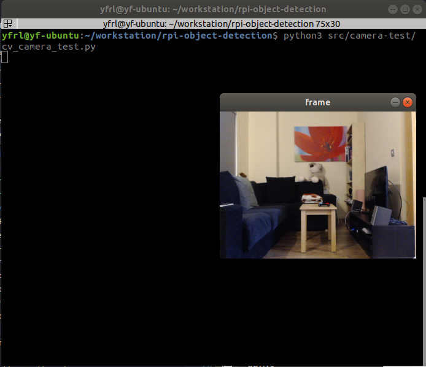
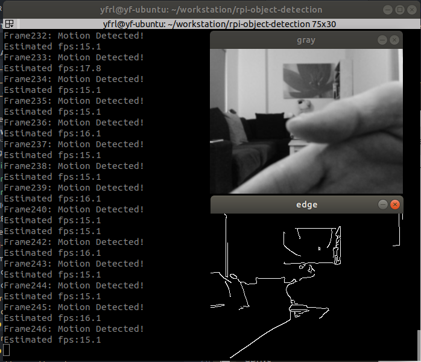
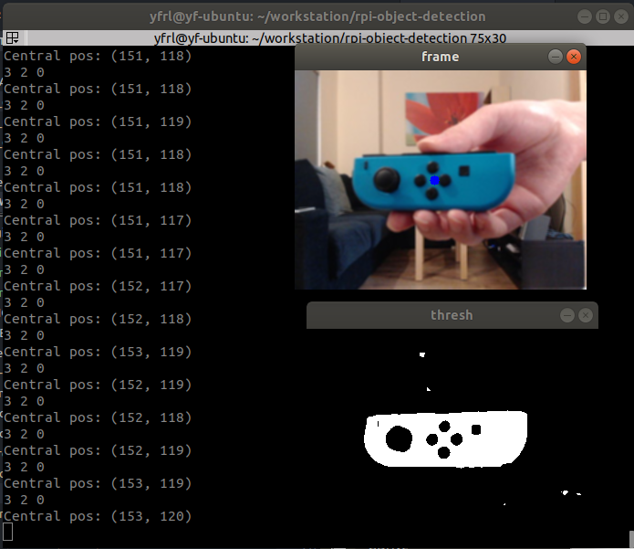
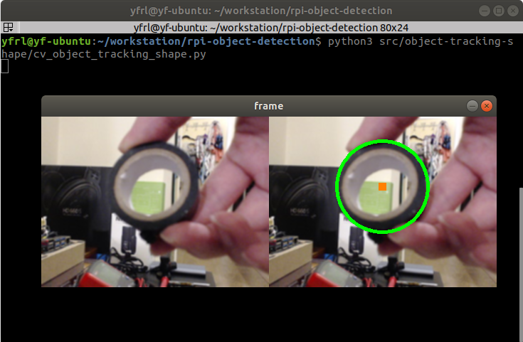
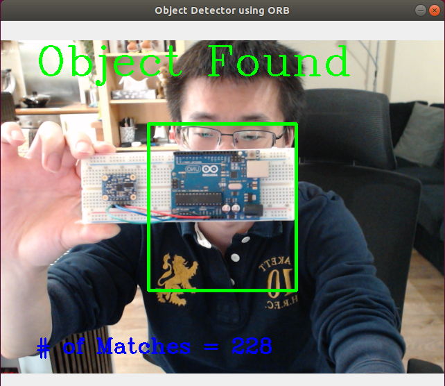
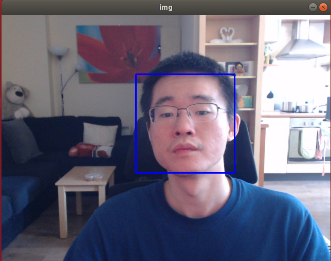

# Raspberry Pi Real-Time Object Detection and Tracking

  

- [Raspberry Pi Real-Time Object Detection and Tracking](#raspberry-pi-real-time-object-detection-and-tracking)
  * [1. Introduction](#1-introduction)
  * [2. Dependency](#2-dependency)
    + [2.1. Packages requirement](#21-packages-requirement)
    + [2.2. Hardware support](#22-hardware-support)
  * [3. What's in this repository](#3-what-s-in-this-repository)
    + [3.1. Camera Test](#31-camera-test)
    + [3.2. Motion Detection](#32-motion-detection)
    + [3.3. Color-based Object Detection and Tracking](#33-color-based-object-detection-and-tracking)
    + [3.4. Shape-based Object Detection and Tracking](#34-shape-based-object-detection-and-tracking)
    + [3.5. Feature-based Object Detection and Tracking (with ORB)](#35-feature-based-object-detection-and-tracking--with-orb-)
    + [3.6. Face Detection and Tracking](#36-face-detection-and-tracking)
    + [3.7. Object Detection using Neural Network (TensorFlow Lite)](#37-object-detection-using-neural-network--tensorflow-lite-)
  * [4. How to Run](#4-how-to-run)
    + [4.1. Install the environment on Raspberry Pi](#41-install-the-environment-on-raspberry-pi)
    + [4.2. Install TensorFlow Lite (optional; only if you want to use the neural network example)](#42-install-tensorflow-lite--optional--only-if-you-want-to-use-the-neural-network-example-)
    + [4.3. Run the scripts](#43-run-the-scripts)
    + [4.4. Change camera resolution](#44-change-camera-resolution)
  * [5. Q&A](#5-q-a)
  * [License](#license)

<small><i><a href='http://ecotrust-canada.github.io/markdown-toc/'>Table of contents generated with markdown-toc</a></i></small>


## 1. Introduction
Using a Raspberry Pi and a camera module for computer vision with OpenCV (and TensorFlow Lite). The aim of this project is to provide a starting point of using RPi & CV in your own DIY / maker projects. Computer vision based on cameras is very powerful and will bring your project to the next level. This allows you to track complicated objects that would otherwise not be possible with other type of sensors (infrared, ultrasonic, LiDAR, etc). 

Note the code is based on Python and OpenCV meaning it is cross-platform. You can run this on other Linux-based platforms as well, e.g. x86/x64 PC, IPC, Jetson, Banana Pi, LattaPanda, BeagleBoard, etc.  


## 2. Dependency
### 2.1. Packages requirement
This project is dependent on the following packages:
- Python >= 3.5
- OpenCV-Python
- OpenCV-Contrib-Python
- NumPy
- SciPy
- Matplotlib
- TensorFlow Lite (*optional*)

### 2.2. Hardware support
- Support Raspberry 1 Model B, Raspberry Pi 2, Raspberry Pi Zero and Raspberry Pi 3/4 (preferable)
  - Different boards will have very varied performance: RPi 3/4 are preferable as they have more powerful CPUs; RPi 1/2 may be struggling and produce very low FPS, in which case you can further reduce the camera resolution (160 x 120).
- Nvidia Jetson Nano (A01) also passed the test.
- Any USB camera supported by Raspberry Pi  
  - To see a list of all supportive cameras, visit http://elinux.org/RPi_USB_Webcams
- The official camera module is **NOT** yet supported by this code, but you can modify the code to use it (Google Raspberry Pi Offical Camera with OpenCV). 
  - (*Todo*) I will add support in the future.


## 3. What's in this repository
Currently the following applications are implemented:

- `src/camera-test`: Test if the camera is working
- `src/motion-detection`: Detect any motion in the frame
- `src/object-tracking-color`: Object detection & tracking based on color
- `src/object-tracking-shape`: Object detection & tracking based on shape
- `src/object-tracking-feature`: Object detection & tracking based on features using ORB
- `src/face-detection`: Face detection & tracking
- (*Todo*) Object detection using Neural Network (TensorFlow Lite)
- (*Todo*) Object detection using YOLO v3 (RPi 4 only)

### 3.1. Camera Test
Test the RPi and OpenCV environment. You are expected to see a pop-up window that has video streams from your USB camera if everything is set up correctly. If the window does not appear, you need to check both of (1) your environment; (2) camera connection.



### 3.2. Motion Detection
Detect object movements in the image and print a warning message if any movement is detected. This detection is based on the mean squared error (MSE) of the difference between two images.



### 3.3. Color-based Object Detection and Tracking
Track an object based on its color in HSV and print its center position. You can choose your own color by clicking on the object of interest. Click multiple times on different points so a full color space is coveraged. You can hard code the parameter so you don't need to pick them again for the next run. The following demo shows how I track a Nintendo game controller in real-time:



### 3.4. Shape-based Object Detection and Tracking
Detect and track round objects using HoughCircles().
Support of sqaures is coming soon. 



### 3.5. Feature-based Object Detection and Tracking (with ORB)
Detect and track an object using its feature. The algorithm I selected here is ORB (Oriented FAST and Rotated BRIEF) for its fast calculation speed to enable real-time detection. To use the example, please prepare an Arduino UNO board in hand (or replace the `simple.png`).




### 3.6. Face Detection and Tracking
Detecting face using Harr Cascade detector.




### 3.7. Object Detection using Neural Network (TensorFlow Lite)
(ongoing) Use TensorFlow Lite to recognise objects. 


## 4. How to Run
### 4.1. Install the environment on Raspberry Pi
```
sudo apt-get install libopencv-dev
sudo apt-get install libatlas-base-dev
pip3 install virtualenv Pillow numpy scipy matplotlib
pip3 install opencv-python opencv-contrib-python
```

### 4.2. Install TensorFlow Lite (optional; only if you want to use the neural network example)
```
wget https://github.com/PINTO0309/Tensorflow-bin/raw/master/tensorflow-2.1.0-cp37-cp37m-linux_armv7l.whl
pip3 install --upgrade setuptools
pip3 install tensorflow-2.1.0-cp37-cp37m-linux_armv7l.whl
pip3 install -e .
```

### 4.3. Run the scripts
Run scripts in the `/src` folder by: `python3 src/$FOLDER_NAME$/$SCRIPT_NAME$.py`

To stop the code, press the `ESC` key on your keyboard.

### 4.4. Change camera resolution
Changing the resolution will significantly impact the FPS. By default it is set to be `320 x 240`, but you can change it to any value that your camera supports at the beginning of each source code (defined by `IMAGE_WIDTH` and `IMAGE_HEIGHT`). Typical resolutions are:

- 160 x 120
- 320 x 240
- 640 x 480 (480p)
- 1280 x 720 (720p)
- 1920 x 1080 (1080p; make sure your camera supports this high resolution.)


## 5. Q&A
Q1: Does this support Nvidia Jetson?  
A1: Yes. I have tested with my Jetson Nano 4GB.

Q2: Does this support the Raspberry Pi camera?  
A2: Not at the moment but I will do it later (if this is not that difficult).


## License
© This source code is licensed under the [MIT License](LICENSE).
